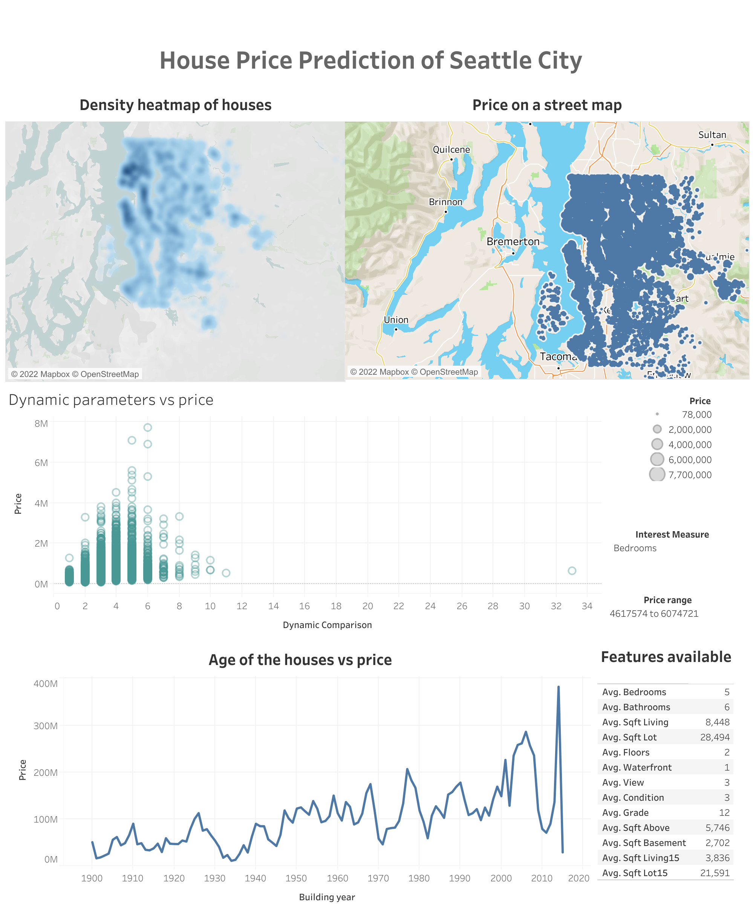

# Housing Price Analysis and Prediction
- 📊 Final Bootcamp Project: Ironhack
- 🗓 Date: 16 September 2022
- 👩🏽‍💻 Created by: Mahnaz Sarker Meem 👋🏼
- 👉🏼  [Check it out here](https://public.tableau.com/app/profile/mahnaz.sarker.meem/viz/Housing_Price_Analysis/Dashboard1) 👈🏼
- [Trello Board](https://trello.com/b/mDTcWUAC/finalbootcampproject)
- [Slides](https://www.canva.com/design/DAFMXT0kHwk/mfXGaWmET_Xh9dGtud9LdA/view?utm_content=DAFMXT0kHwk&utm_campaign=designshare&utm_medium=link&utm_source=publishsharelink)

## Table of Contents
- [About](#about)
- [Technologies used](#technologies-used)
- [Process](#process)
- [Data](#dataset)
- [Visualization](#visualization)
- [Slides](#slides)

## About
Whether to buy a house or sell, one should know the estimated price, to optimize the purchase or to calculate the profit margin. This is a big market with lots of possibilities. Therefore, this data is suitable for following two scenarios:
1. A real estate company wants to build a machine learning model to predict the selling prices of houses based on different features.
2. An individual person wants to buy his/her dream-house within a price range.

To predict the house prices I first cleaned the data. Preprocess the data for model building. Used logarithmic scale to normalize the skewed price data to have better prediction. Based on different features the house prices have been explored and estimated.

The main objective was to build a machine learning model to predict the price of a house in Seattle city.

Note that, this [dataset](https://github.com/Mahnaz-Meem/Housing_price_prediction_ironhack/tree/main/data/raw) corresponds to housing price of Seattle city, King County, WA in 2014-2015. 

## Technologies used
* Python (pandas, numpy, matplotlib, seaborn, plotly, sklearn, sweetviz, xlrd, pickle)
* Tableau
* ArcGIS
* Streamlit
* Canva
* Trello Board
* MySQL
* Canva

## Process
* Github and Trello: Created a Github repo and trello board for sharing and keeping the project organized and safe.
* SQL: Used MySQL for answering  some business question.
* EDA: Assessed the dataset for cleaning and explored them using Sweetviz, Seaborn, Matplotlib and ArcGIS pro.
* Data cleaning and wrangling: Used date of building, sold and renovation to consider the age and renovation. Considered duplicated houses and dropped them keeping the latest one and dropped the one house with 33 bathrooms because it did not make sense considering the other given features.
* Preprocessing: Normalized the data using Standard Scaler. Used Grid Search CV to identify the best parameters for models.
* Machine Learning: Trained automated machine learning models and corresponding R2 for them. The models are: Linear Regression, SGD model, K Neighbours Regressor, Decision Tree Regressor, and Random Forest Regressor. Based on the R2 of the train and test sets "Random Forest Regressor" has been chosen for the final prediction.
* Streamlit: Used stremlit app to give price prediction for any given feature values.
* Canva: Used Canva for presentation preparation.

## Data
- The data is available on Kaggle and also here 👉🏼 [Link](https://github.com/Mahnaz-Meem/Housing_price_prediction_ironhack/tree/main/data/raw)

## Visualization
The Tableau dashboard is very useful to understand the housing distribution, different features vs price and how the price is inversely proportional to the age of the house. When zoomed in on the "Price on a street map", it is evident that price of houses near to a waterbody is much higher than the fartherst ones. The features available would be very interesting, specially for a buyer's perspective to visualize which features one might avail based on a particular price range. One can change the sliding bar and set the price range which one can afford and see what features they can expect in that price range. It is also useful for a real estate company of that area.

Please click on the link to open, visualize and interact with the Tableau dashboard.

[Link](https://public.tableau.com/app/profile/mahnaz.sarker.meem/viz/housing_price_16633192492690/House_price_dashboard)

## Slides
Please click on the link to visualize the Canva presentation.
[Link](https://www.canva.com/design/DAFMXT0kHwk/mfXGaWmET_Xh9dGtud9LdA/view?utm_content=DAFMXT0kHwk&utm_campaign=designshare&utm_medium=link&utm_source=publishsharelink)
