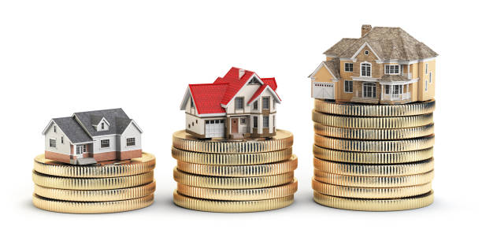

# Housing Price Analysis and Prediction
- 📊 Final Bootcamp Project: Ironhack
- 🗓 Date: 16 September 2022
- 👩🏽‍💻 Created by: Mahnaz Sarker Meem 👋🏼
- 👉🏼  [Check it out here](https://public.tableau.com/app/profile/mahnaz.sarker.meem/viz/Housing_Price_Analysis/Dashboard1) 👈🏼
- [Trello Board](https://trello.com/b/mDTcWUAC/finalbootcampproject)

## Table of Contents
- [About](#about)
- [Technologies used](#technologies-used)
- [Data](#dataset)
- [Visualization](#visualization)

## About
Whether to buy a house or sell, one should know the estimated price, to optimize the purchase or to calculate the profit margin. This is a big market with lots of possibilities.

To predict the house prices I first cleaned the data. Preprocess the data for model building. Used logarithmic scale to normalize the skewed price data to have better prediction. Based on different features the house prices have been explored and estimated.

The main objective was to build a machine learning model to predict the price of a house in Seattle city.

Note that, this [dataset](https://github.com/Mahnaz-Meem/Housing_price_prediction_ironhack/tree/main/data/raw) corresponds to housing price of Seattle city, King County, WA in 2014-2015. 

## Technologies used
* Python (pandas, numpy, matplotlib, seaborn, plotly, sklearn, sweetviz, xlrd, pickle)
* Tableau
* ArcGIS
* Streamlit
* Canva
* Trello Board
* MySQL

## Data
- [Link](https://github.com/Mahnaz-Meem/Housing_price_prediction_ironhack/tree/main/data/raw)

## Visualization

Please click on the link to open and visualize the Tableau stories.

[Link](https://public.tableau.com/app/profile/mahnaz.sarker.meem/viz/housing_price_16633192492690/House_price_dashboard)

